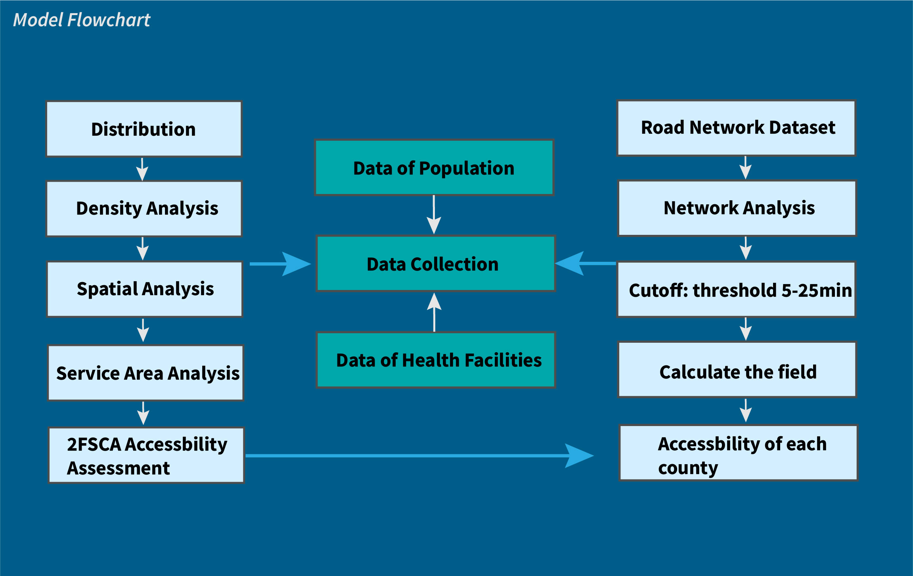
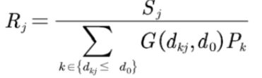
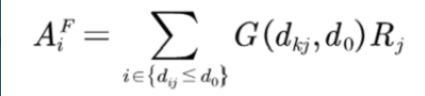
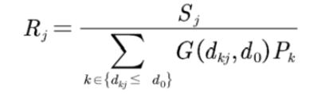
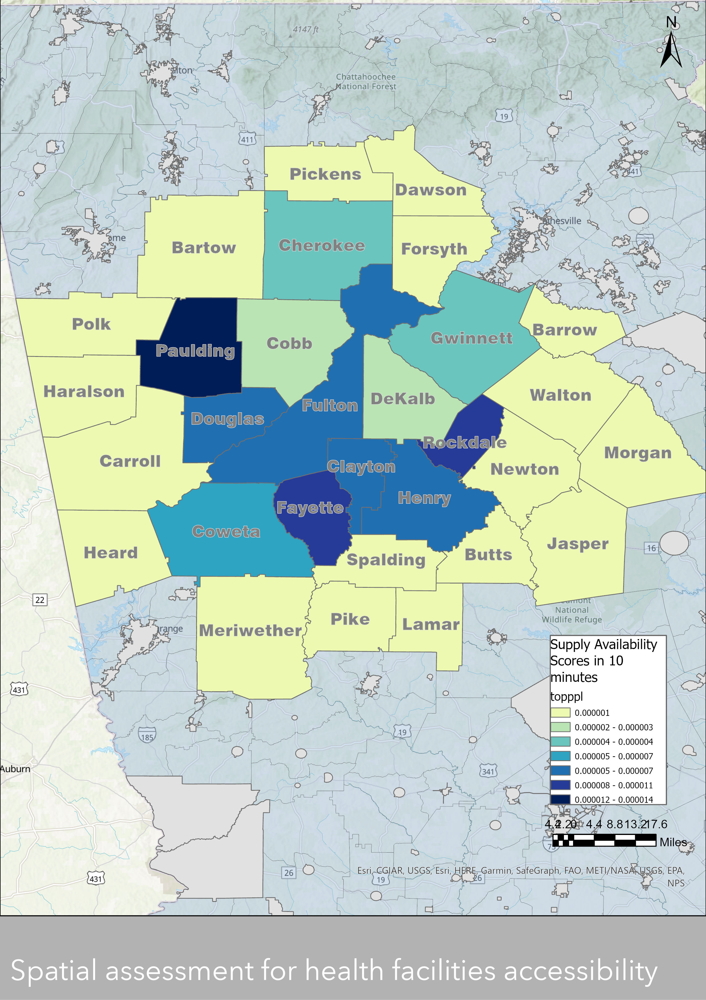
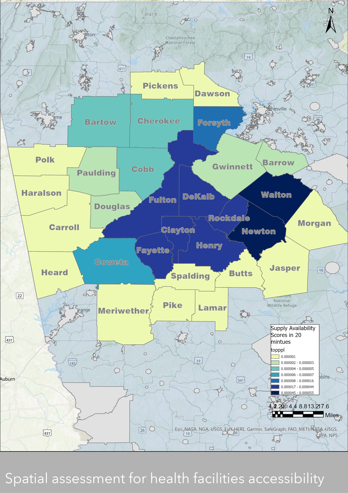
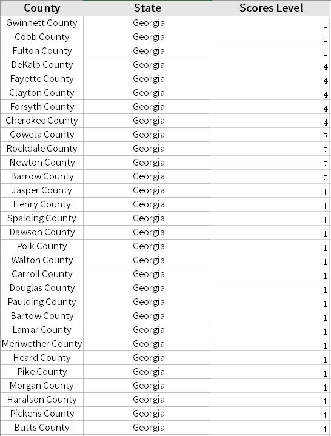
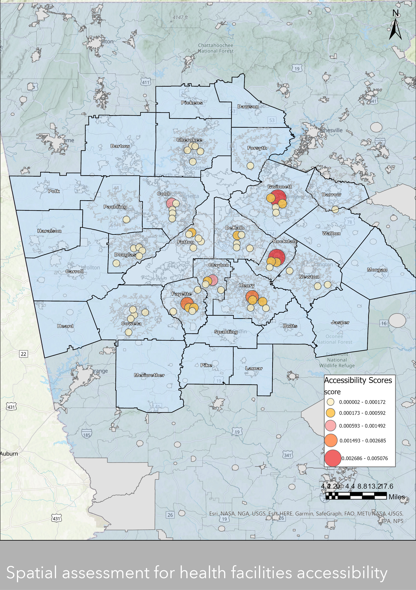
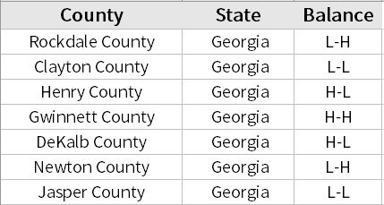
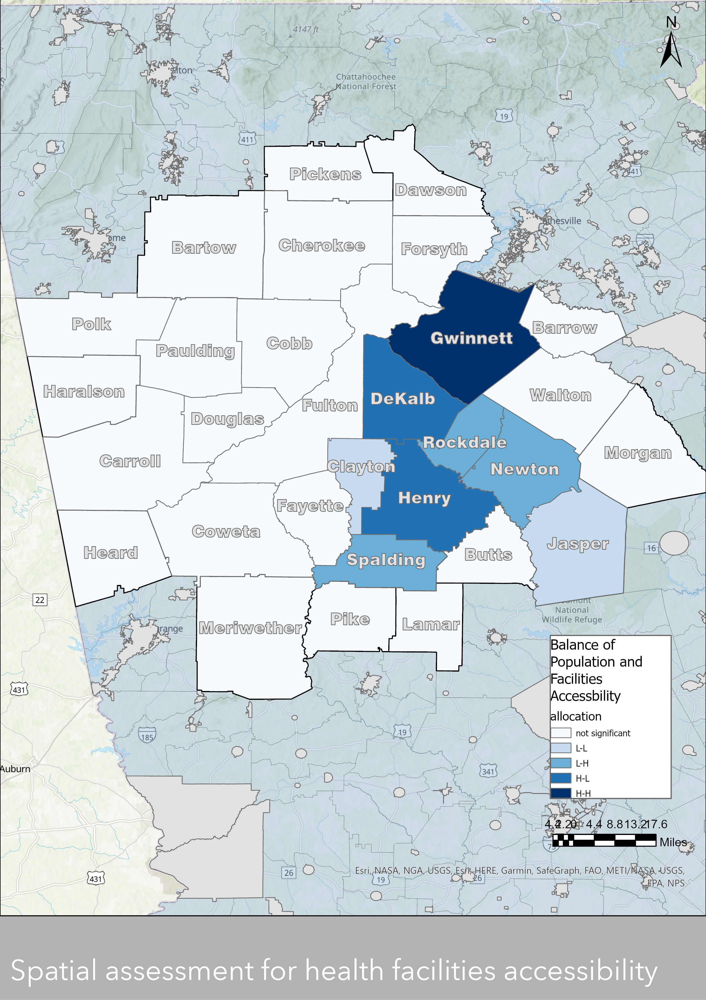

# Spatial Accessibility Evaluation of Health Facilities in Atlanta Metro Area

## Overview
This project evaluates the spatial accessibility of health facilities within the Atlanta Metro Area using the Hierarchical Two-Step Floating Catchment Area (2SFCA) method. The study addresses the growing healthcare demand in the region and aims to assess the balance between healthcare supply and demand.

## Background
The study focuses on the Atlanta-Sandy Springs-Roswell metro area, which includes 29 counties. According to U.S. Census data, the population has been steadily increasing, particularly in counties like Fulton and Gwinnet.

<div style="text-align: center;">
    
    <p><em>Figure 1: Population distribution in the ATL metro area</em></p>
</div>


## Problem Statement
Atlanta's rapid urbanization has led to a mismatch between healthcare supply and demand. This project aims to quantify the accessibility of public health facilities, considering driving as the primary mode of transportation.

## Data
The data for this study was sourced from the U.S. Census Bureau, OpenStreetMap (OSM), and other relevant sources. The table below summarizes the data used:

| Data Type       | Source        | Format  |
| --------------- | ------------- | ------- |
| Population Data | U.S. Census   | Vector  |
| Health Facilities | OSM        | Vector  |
| Roads           | OSM           | Vector  |
| Bed Size        | Health Facility Databases | Vector  |

## Methodology
The 2SFCA method was applied using Python and ArcGIS Pro to assess the spatial accessibility of healthcare facilities. The following steps outline the methodology:

1. **Data Collection and Processing**:
   - Collected population and health facility data.
   - Cleaned and combined data using Python.
   
<div style="text-align: center;">
    
    <p><em>Figure 2: Overview of the Data Collection and Processing Workflow</em></p>
</div>

2. **Accessibility Calculation**:
   - Applied the 2SFCA method to calculate accessibility, considering different travel distances.

<div style="text-align: center;">
    
    <p><em>Figure 3: Step 1 of the 2SFCA Method</em></p>
</div>

<div style="text-align: center;">
    
    <p><em>Figure 4: Step 2-1 of the 2SFCA Method</em></p>
</div>

<div style="text-align: center;">
    
    <p><em>Figure 5: Step 2-2 of the 2SFCA Method</em></p>
</div>


## Results

### Supply Analysis
The results from the supply analysis indicated significant spatial disparities in healthcare accessibility.


<div style="text-align: center;">
    
    <p><em>Figure 6: Supply Scores in 10 Minutes Drive Mode</em></p>
</div>

<div style="text-align: center;">
    
    <p><em>Figure 7: Supply Scores in 20 Minutes Drive Mode</em></p>
</div>

### Accessibility Analysis
The accessibility map shows varying levels of access across the metro area. Gwinnett County had the highest scores, while counties near the state boundary had the lowest.


<div style="text-align: center;">
    
    <p><em>Figure 8: Accessibility Score Rankings in the ATL Metro Area</em></p>
</div>

<div style="text-align: center;">
    
    <p><em>Figure 9: Accessibility Scores in ATL Metro Area</em></p>
</div>


### Balance of Population Demand and Supply
A balance score was developed to assess the match between population demand and healthcare supply.
From the map, there are two "low-low" category and "high and high" category. 


<div style="text-align: center;">
    
    <p><em>Table 1: Balance of Population Demand and Supply Accessibility</em></p>
</div>

<div style="text-align: center;">
    
    <p><em>Figure 10: Balance of Population Demand and Supply Accessibility Map</em></p>
</div>


## Conclusion
The 2SFCA method provided valuable insights into the spatial accessibility of healthcare facilities in the Atlanta metro area. The study highlights the need for improvements in healthcare services in areas with low accessibility.

## References
1. Jin, M., Liu, L., Tong, D., Gong, Y., & Liu, Y. (2019). Evaluating the Spatial Accessibility and Distribution Balance of Multi-Level Medical Service Facilities. *International Journal of Environmental Research and Public Health, 16*(7), 1150. [MDPI AG](http://dx.doi.org/10.3390/ijerph16071150)
2. Yang, N., Chen, S., Hu, W., Wu, Z., & Chao, Y. (2016). Spatial Distribution Balance Analysis of Hospitals in Wuhan. *International Journal of Environmental Research and Public Health, 13*(10), 971. [MDPI AG](http://dx.doi.org/10.3390/ijerph13100971)
3. Ghorbanzadeh, M., Kim, K., Ozguven, E. E., & Horner, M. W. (2021). Spatial accessibility assessment of COVID-19 patients to healthcare facilities: A case study of Florida. *Travel Behaviour and Society, 24*, 95-101. [Elsevier](https://doi.org/10.1016/j.tbs.2021.03.004)

## Appendix: Programming Document

### 2SFCA Tools Implementation in ArcGIS Pro

```python
# -*- coding: utf-8 -*-
import arcpy
import pandas as pd
import numpy as np

class Toolbox(object):
    def __init__(self):
        """Define the toolbox (the name of the toolbox is the name of the
        .pyt file)."""
        self.label = "2SFCA Tools"
        self.alias = "2SFCA"
        self.tools = [SFCA]

class SFCA(object):
    def __init__(self):
        """Define the tool (tool name is the name of the class)."""
        self.label = "Tool"
        self.description = ""
        self.canRunInBackground = False

    def getParameterInfo(self):
        input_features1= arcpy.Parameter(
            name = "demand features",
            displayName = "demand Features",
            datatype = "GPFeatureLayer",
            parameterType = "Required",
            direction = "Input")
        input_features2= arcpy.Parameter(
            name = "supply features",
            displayName = "supply Features",
            datatype = "GPFeatureLayer",
            parameterType = "Required",
            direction = "Input")
        output_features = arcpy.Parameter(
            name = "output_features",
            displayName = "Output Features",
            datatype = "GPFeatureLayer",
            parameterType = "Required",
            direction = "Output")
        parameters = [input_features1, input_features2, output_features]
        return parameters

    def execute(self, parameters, messages):
        inputfc1= parameters[0].valueAsText
        inputfc2= parameters[1].valueAsText
        outputfc = parameters[2].valueAsText
        
        # Create a list to store the input data
        data = []
        # Get the input fields from the demand data 
        with arcpy.da.SearchCursor(inputfc1, ['GEOID', 'estimateppl', 'County']) as cursor:
            for row in cursor:
                data.append(row)

        demand_df = pd.DataFrame(data, columns=['GEOID', 'estimateppl', 'County'])
        # Get the input fields from the supply data
        with arcpy.da.SearchCursor(inputfc2, ['County', 'ToBreak', 'FacilityID', 'join_Count']) as cursor:
            for row in cursor:
                data.append(row)

        supply_df = pd.DataFrame(data, columns= ['County', 'ToBreak', 'FacilityID', 'join_Count'])

        # Merge supply_df and demand_df
        service_population = pd.merge(supply_df, demand_df, how='left', on='County')

        # Calculate 'topppl' column
        service_population['topppl'] = service_population.apply(lambda x: x['join_Count'] / x['estimateppl'] if x['estimateppl'] != 0 else 0, axis=1)

        # Group by 'GEOID' and sum 'topppl'
        FCA = service_population.groupby(['GEOID'])['topppl'].sum().reset_index()

        # Convert FCA DataFrame to a structured NumPy array
        fca_array = FCA.to_records(index=False)

        # Use InsertCursor to insert rows into outputfc
        fields = ['GEOID', 'estimateppl', 'County', 'topppl']
        with arcpy.da.InsertCursor(outputfc, fields) as cursor:
            for row in fca_array:
                cursor.insertRow(row)

        # Use UpdateCursor to update 'topppl' based on FCA values
        with arcpy.da.UpdateCursor(outputfc, ['GEOID', 'topppl']) as cursor:
            for row in cursor:
                if row[0] in FCA['GEOID'].values:
                    row[1] = FCA.loc[FCA['GEOID'] == row[0], 'topppl'].values[0]
                    cursor.updateRow(row)

    def postExecute(self, parameters):
        """This method takes place after outputs are processed and added to the display."""
        return
