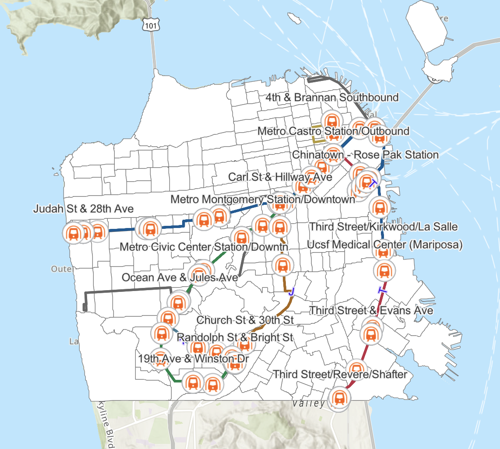
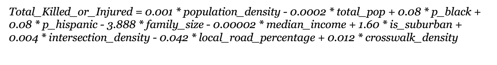
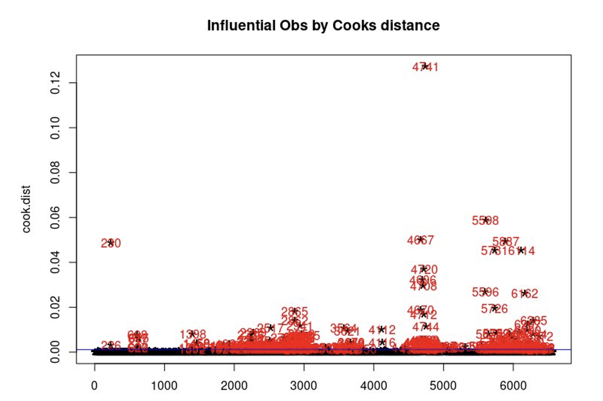
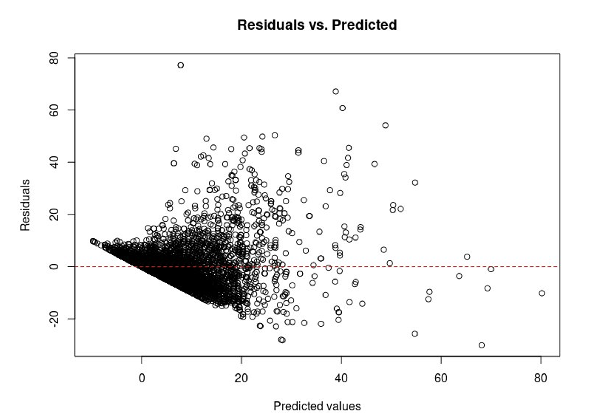
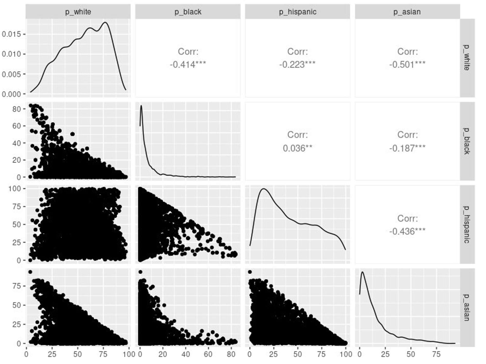
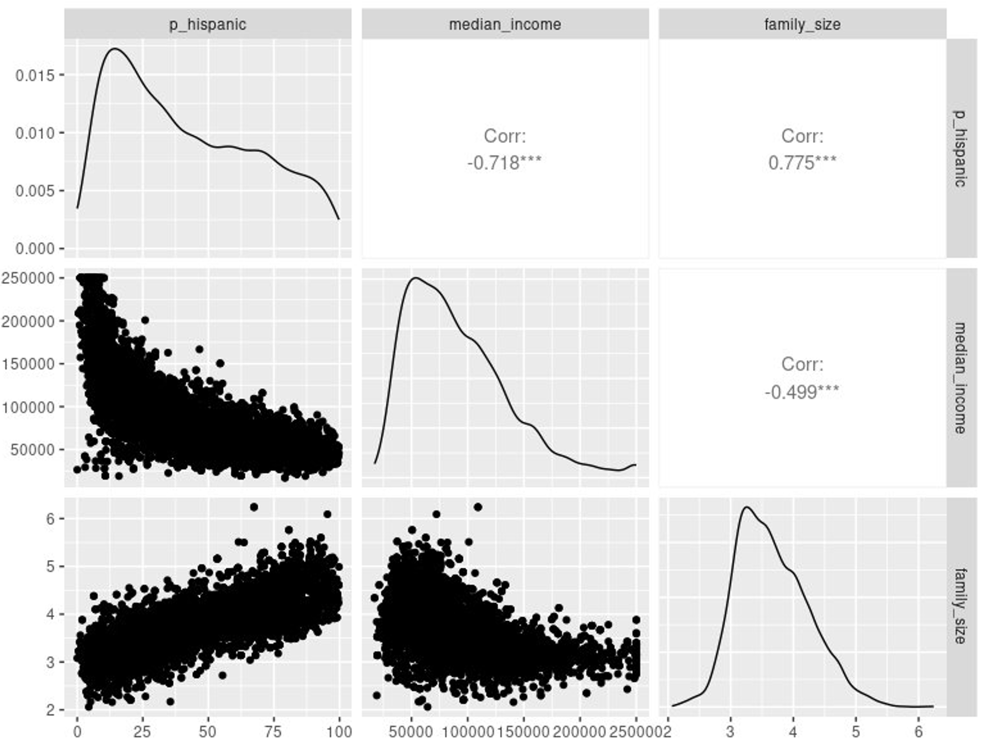

# Assessing the Traffic Injuries Involving Pedestrians and Bicyclists near school area in California

## Overview

This project aims to identify and analyze the factors contributing to traffic injuries and fatalities involving pedestrians and bicyclists in various counties of California. The study employs regression modeling to understand the influence of demographic, socioeconomic, and infrastructural variables on these incidents. The findings are intended to inform policymakers and urban planners on potential areas for intervention to enhance traffic safety.

## Data Sources

### 1. Census Data
The demographic and socioeconomic data used in this study were obtained from the American Community Survey (ACS) 2018, covering 12 counties in California. The data includes variables such as population density, racial composition (percentage of Black and Hispanic residents), median income, and average family size.

### 2. Public School Locations
Public school location data were collected from the National Center for Education Statistics (NCES) for the academic years 2015-16, 2018-19, and 2021-22. This data was used to examine the proximity of traffic incidents to school locations, which is critical for understanding the risk areas for students.

### 3. Traffic Injury Data
Traffic injury and fatality data were sourced from the University of California, Berkeley's Transportation Injury Mapping System (TIMS) for the years 2015 to 2022. This dataset includes detailed records of incidents involving pedestrians and bicyclists, including geographic coordinates, severity, and time of occurrence.


| **Variable**                | **Data Source**                                                   |
|-----------------------------|-------------------------------------------------------------------|
| **NCES School Locations**    | National Center for Education Statistics (NCES)                  |
| **Crash Data**               | Transportation Injury Mapping System (TIMS) from UC Berkeley     |
| **Population Density**       | U.S. Census Bureau                                               |
| **Race Percentage**          | U.S. Census Bureau                                               |
| **Median Family Income**     | U.S. Census Bureau                                               |
| **Total Family Size**        | U.S. Census Bureau                                               |
| **Local Roads Percentage**   | OpenStreetMap (OSM)                                              |
| **Intersection Density**     | OpenStreetMap (OSM)                                              |
| **Crosswalk Density**        | OpenStreetMap (OSM)                                              |
| **Locale**                   | National Center for Education Statistics (NCES)                  |

## Variables and Data Description

| **Variable**           | **Data Type**    | **Explanation**                                                                 |
|------------------------|------------------|---------------------------------------------------------------------------------|
| **Local Roads Percentage** | Numeric Data      | The length of roads in the neighborhood divided by the total road length within a bounding box centered around the school location. |
| **Intersection Density**   |  Numeric Data      | The number of intersections per half-mile road within the bounding box centered around the school location. |
| **Crosswalk Density**      |  Numeric Data      | The number of crosswalks per road length mile. |
| **Total Family Size**      | Numeric Data      | The total number of families at the census tract level. |
| **Median Family Income**   |  Numeric Data      | The median family income at the census tract level. |
| **Population Density**     | Numeric Data      | The total population divided by the area size (miles/square miles). |
| **Race Percentage**        |  Numeric Data      | The number of different race populations as a percentage of the total population. |
| **Crash Data**             | Numeric Data      | The count of pedestrians and bicyclists killed or injured within 0.5 miles of the school during the school year. |
| **Locale**                 | Categorical Data  | A code describing the location of the school. |

## Methodology

### Data Preprocessing

1. **Subsetting and Geocorrection**:
   The data was geocorrected to ensure all datasets were aligned to a consistent coordinate system, using a threshold of less than 0.05 errors.

2. **Feature Engineering**:
   - **Intersection Density**: Calculated the density of intersections within each census tract to capture the complexity of the road network.
   - **Local Road Percentage**: Measured the percentage of local roads as opposed to highways to understand the traffic mix.
   - **Crosswalk Density**: Calculated the density of crosswalks to account for pedestrian infrastructure.

## Study Area

<div style="display: flex; align-items: center;">

<div style="flex: 1;">
<p>The study focuses on 12 counties in California, which are categorized as follows:</p>

### LA Counties:
- Los Angeles County
- Ventura County
- Orange County
- San Bernardino County
- Riverside County

### San Diego County:
- San Diego County

### Bay Area Counties:
- San Francisco County
- Alameda County
- San Mateo County
- Santa Clara County
- Contra Costa County
- Marin County

### Schools Coverage:
- **Total Schools in 2018:** 6,469 schools
</div>

<div style="flex: 1; text-align: right;">
    
</div>

</div>


### Regression Model

A multiple linear regression model was constructed to predict the total number of individuals killed or injured in traffic incidents, using the following formula:


### Regression Model for Total Killed or Injured

The estimated model for predicting the number of traffic injuries involving pedestrians and bicyclists near school areas in California is shown below:



**Variables:**
- **population_density**: Number of people per square mile
- **total_pop**: Total population in the area
- **p_black**: Proportion of the population that is Black
- **p_hispanic**: Proportion of the population that is Hispanic
- **family_size**: Average family size in the area
- **median_income**: Median household income in the area
- **is_suburban**: A binary variable indicating whether the area is suburban (1 if suburban, 0 if not)
- **intersection_density**: Number of intersections per square mile
- **local_road_percentage**: Percentage of local roads in the area
- **crosswalk_density**: Number of crosswalks per square mile


## Diagnose Potential Problems

### Outliers and Model Diagnostics

- **Outliers Check**: Conducted an outlier analysis for the selected model.
- **Cook's Distance**: Charted the Cook's distance to identify points significantly distant from others.
- **Significant Outlier**: Identified a point with a Cook's distance significantly larger than others. This point corresponds to Treasure Island.
- **Final Model Adjustment**: Removed the identified outlier along with 5 other points that had a Cook's distance greater than 0.04.


<div style="display: flex;">
  <div style="flex: 1;">
    <ul>
      <li>Below is a visualization of the Cook's distance chart highlighting the outliers:</li>
<!--       <li>The map below shows the location of the significant outlier, Treasure Island:</li> -->
    </ul>
  </div>
  <div style="flex: 1;">
    
<!--      -->
  </div>
</div>


## Nonlinearity Check

- **Dependent Variable**: The dependent variable is discrete and represents infrequent events.
- **Residuals Examination**: Conducted a visual examination of residuals to check for heteroskedasticity.
- **Clustering Observed**: Noticed a significant amount of clustering in the lower values in the residual plot.


<div style="display: flex;">
  <div style="flex: 1;">
    <ul>
      <li>The residual plot below illustrates the clustering observed in the lower values:</li>
    </ul>
  </div>
  <div style="flex: 1;">
    
  </div>
</div>

## Multicollinearity Check

- **Multicollinearity Issues**: Identified two instances of multicollinearity in our data.
  - **Locale Variable & Demographic Data**: High correlation observed between `is_urban` and `is_suburban` (-0.895).
  - **Subset Analysis**: When all groups were included, Hispanic percentage became largely determined by the others.
  - **White and Asian Correlation**: Found a negative correlation between White and Asian percentages (-0.501).
- **Final Model Decision**: 
  - Removed White and Asian percentages from the final model.
  - Kept Hispanic and Black percentages to reduce multicollinearity and improve model robustness.


<div style="display: flex;">
  <div style="flex: 1;">
    <ul>
      <li>The correlation matrix below highlights the multicollinearity issues:</li>
    </ul>
  </div>
  <div style="flex: 1;">
    
     
  </div>
</div>

## Conclusion

## References

### References

- McArthur, A., Savolainen, P. T., & Gates, T. J. (2014). Spatial Analysis of Child Pedestrian and Bicycle Crashes: Development of Safety Performance Function for Areas Adjacent to Schools. *Transportation Research Record, 2465*(1), 57-63. [https://doi.org/10.3141/2465-08](https://doi.org/10.3141/2465-08)

- Clifton, K. J., & Kreamer-Fults, K. (2007). An examination of the environmental attributes associated with pedestrian-vehicular crashes near public schools. *Accident; analysis and prevention, 39*(4), 708–715. [https://doi.org/10.1016/j.aap.2006.11.003](https://doi.org/10.1016/j.aap.2006.11.003)

- Abdel-Aty, M., Chundi, S. S., & Lee, C. (2007). Geo-spatial and log-linear analysis of pedestrian and bicyclist crashes involving school-aged children. *Journal of safety research, 38*(5), 571–579. [https://doi.org/10.1016/j.jsr.2007.04.006](https://doi.org/10.1016/j.jsr.2007.04.006)

- Lascala, E. A., Gruenewald, P. J., & Johnson, F. W. (2004). An ecological study of the locations of schools and child pedestrian injury collisions. *Accident; analysis and prevention, 36*(4), 569–576. [https://doi.org/10.1016/S0001-4575(03)00063-0](https://doi.org/10.1016/S0001-4575(03)00063-0)

## Appendix:Programming Code Reference


```r
library(tidyverse)
library(tidycensus)
library(sf)
library(car)


library(ggplot2)
census_api <- '' # add API key here
census_api_key(census_api)
my_counties <- c(
  "Los Angeles County", "Ventura County", "Orange County", "San Bernardino County",
  "Riverside County", "San Diego County", "San Francisco County", "Alameda County",
  "San Mateo County", "Santa Clara County", "Contra Costa County", "Marin County"
)


# Fetch ACS data for population and race (2018)
pop2018 <- get_acs(
  geography = 'tract', state = 'CA', county = my_counties,
  variables = c(
    total_pop = "DP05_0001E", p_white = "DP05_0037PE", p_black = "DP05_0038PE",
    p_asian = "DP05_0044PE", p_hispanic = "DP05_0071PE"
  ),
  year = 2018, geometry = TRUE, survey = "acs5", output = "wide"
)


# Calculate population density (people per square mile)
pop2018.var <- pop2018 %>% select(GEOID, NAME, total_pop, p_white, p_black, p_asian, p_hispanic)

pop2018.sep <- pop2018.var %>% separate(NAME, into = c("tract", "county", "state"), sep = ", ")

#Fetch median income data (2018)
med_income2018 <- get_acs(
  geography = 'tract', state = 'CA', county = my_counties,
  variables = c(median_income = "S1903_C03_015E"),
  year = 2018, geometry = TRUE, output = "wide"
)
med_income2018.var <- med_income2018 %>% select(GEOID, NAME, median_income) %>%
  separate(NAME, into = c("tract", "county", "state"), sep = ", ")

#Fetch average family size data (2018)
fam_size2018 <- get_acs(
  geography = 'tract', state = 'CA', county = my_counties,
  variables = c(family_size = "S1101_C01_004E"),
  year = 2018, geometry = TRUE, output = "wide"
)
fam_size2018.var <- fam_size2018 %>% select(GEOID, NAME, family_size) %>%
  separate(NAME, into = c("tract", "county", "state"), sep = ", ")

# Transform coordinates to a consistent CRS
pop_race_transformed <- st_transform(pop2018.sep, crs = 4326)
med_income_transformed <- st_transform(med_income2018.var, crs = 4326)
fam_size_transformed <- st_transform(fam_size2018.var, crs = 4326)

final.2018.19.halfmi_tract <- final.2018.19.halfmi %>%
  st_join(pop_race_transformed, join = st_within) %>%
  st_join(med_income_transformed, join = st_within) %>%
  st_join(fam_size_transformed, join = st_within)


final_table <- final_1.table %>%
  select(NCESSCH, CNTY, NMCNTY, LOCALE, GEOID.x, tract.x, county.x, state.x,
         ct_ped_killed_2015_16, ct_ped_injured_2015_16, ct_bike_killed_2015_16, ct_bike_injured_2015_16,
         ct_ped_killed_2018_19, ct_ped_injured_2018_19, ct_bike_killed_2018_19, ct_bike_injured_2018_19,
         ct_ped_killed_2021_22, ct_ped_injured_2021_22, ct_bike_killed_2021_22, ct_bike_injured_2021_22,
         total_pop, p_white, p_black, p_asian, p_hispanic, population_density,
         median_income, family_size, geometry2015_16, geometry2018_19, geometry2021_22)


write_csv(final_table, "schools_crash_counts_census_new.csv")

#repeat the process for the selcted year
pop2015 <- get_acs(
  geography = 'tract', state = 'CA', county = my_counties,
  variables = c(total_pop = "DP05_0001E", p_white = "DP05_0032PE", p_black = "DP05_0033PE", p_asian = "DP05_0039PE", p_hispanic = "DP05_0066PE"),
  year = 2015, geometry = TRUE, output = "wide"
)
pop2015.var <- pop2015 %>% select(GEOID, NAME, total_pop, p_white, p_black, p_asian, p_hispanic) %>%
  separate(NAME, into = c("tract", "county", "state"), sep = ", ")

pop2021 <- get_acs(
  geography = 'tract', state = 'CA', county = my_counties,
  variables = c(total_pop = "DP05_0001E", p_white = "DP05_0032PE", p_black = "DP05_0033PE", p_asian = "DP05_0039PE", p_hispanic = "DP05_0066PE"),
  year = 2021, geometry = TRUE, output = "wide"
)
pop2021.var <- pop2021 %>% select(GEOID, NAME, total_pop, p_white, p_black, p_asian, p_hispanic) %>%
  separate(NAME, into = c("tract", "county", "state"), sep = ", ")


# Prepare the final dataset for regression analysis
final_data <- pop2018.sep %>%
  left_join(med_income2018.var, by = "GEOID") %>%
  left_join(fam_size2018.var, by = "GEOID")


# Create a simplified regression model based on the variables
model <- lm(Total_Killed_or_Injured ~ population_density + total_pop + p_black +
              p_hispanic + family_size + median_income + is_suburban +
              intersection_density + local_road_percentage + crosswalk_density,
            data = final_data)


# Summary of the model
summary(model)


# Cook's Distance to identify influential points
cook_dist <- cooks.distance(model)
plot(cook_dist, main="Cook's Distance", ylab="Cook's Distance", xlab="Observation")
abline(h = 4/(nrow(final_data)-length(model$coefficients)-1), col="red")

high_influence <- which(cook_dist > 0.04)
final_data_filtered <- final_data[-high_influence, ]
model_filtered <- lm(Total_Killed_or_Injured ~ population_density + total_pop + p_black +
                       p_hispanic + family_size + median_income + is_suburban +
                       intersection_density + local_road_percentage + crosswalk_density,
                     data = final_data_filtered)
summary(model_filtered)

# Residuals Analysis 
par(mfrow = c(1, 1))
plot(model_filtered$residuals, main="Residuals Plot", ylab="Residuals", xlab="Fitted Values")
abline(h = 0, col="red")

#  Multicollinearity 
vif_values <- vif(model_filtered)
print(vif_values)

#  Nonlinearity
ggplot(final_data_filtered, aes(.fitted, .resid)) +
  geom_point() +
  geom_hline(yintercept = 0, color = "red") +
  labs(x = "Fitted Values", y = "Residuals") +
  ggtitle("Residuals vs Fitted Values")

#  Multicollinearity Visualization
correlation_matrix <- final_data_filtered %>%
  select(population_density, total_pop, p_black, p_hispanic, family_size, median_income, 
         is_suburban, intersection_density, local_road_percentage, crosswalk_density) %>%
  cor()

ggcorr(correlation_matrix, label = TRUE, label_size = 3)


