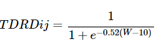
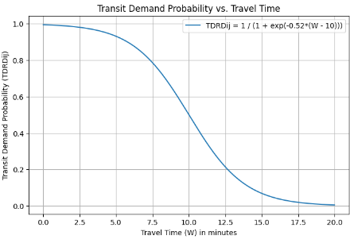
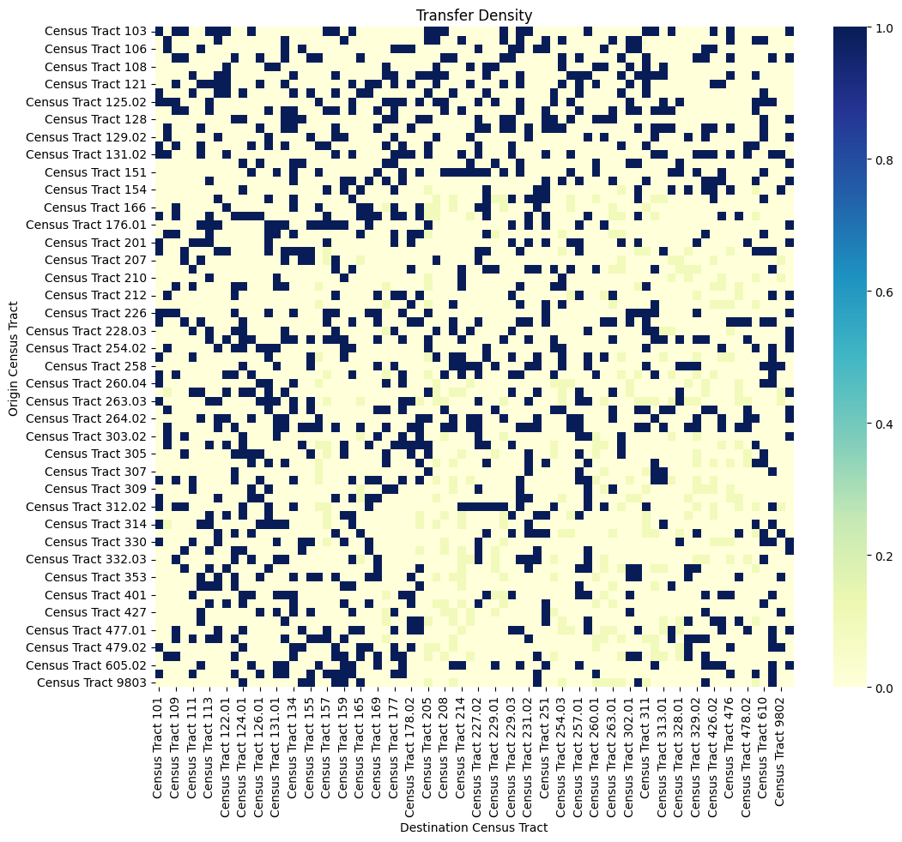
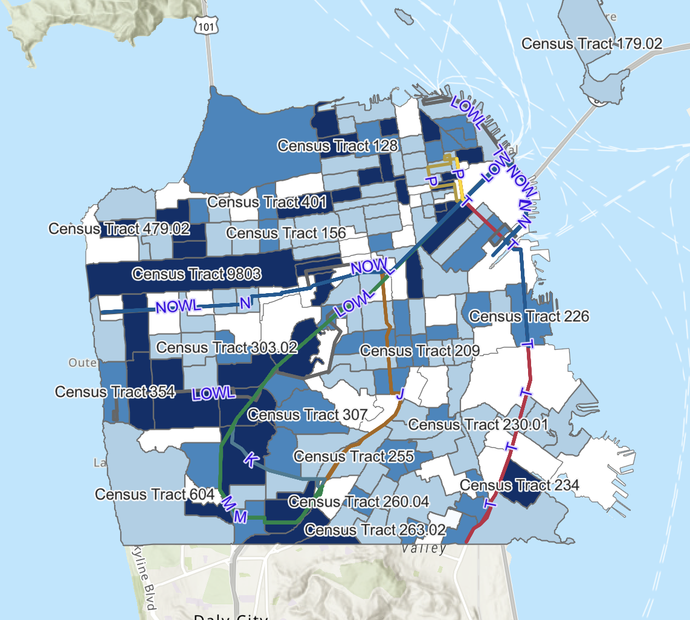
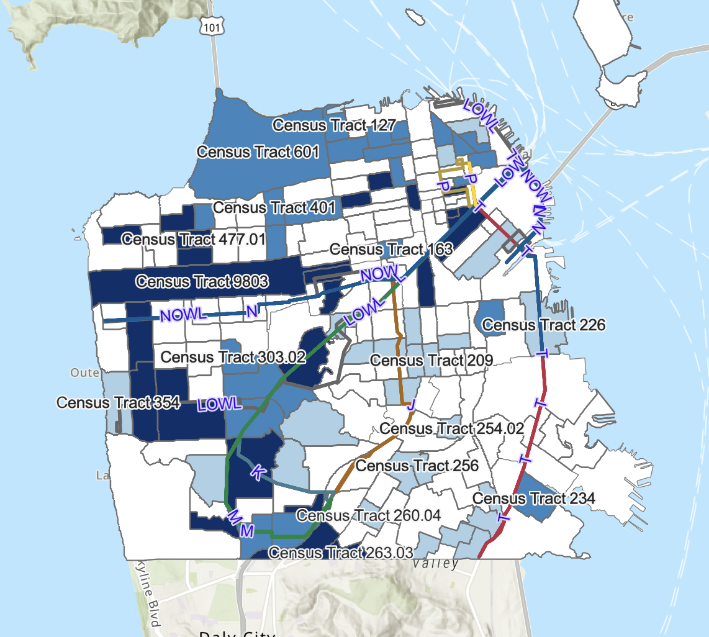
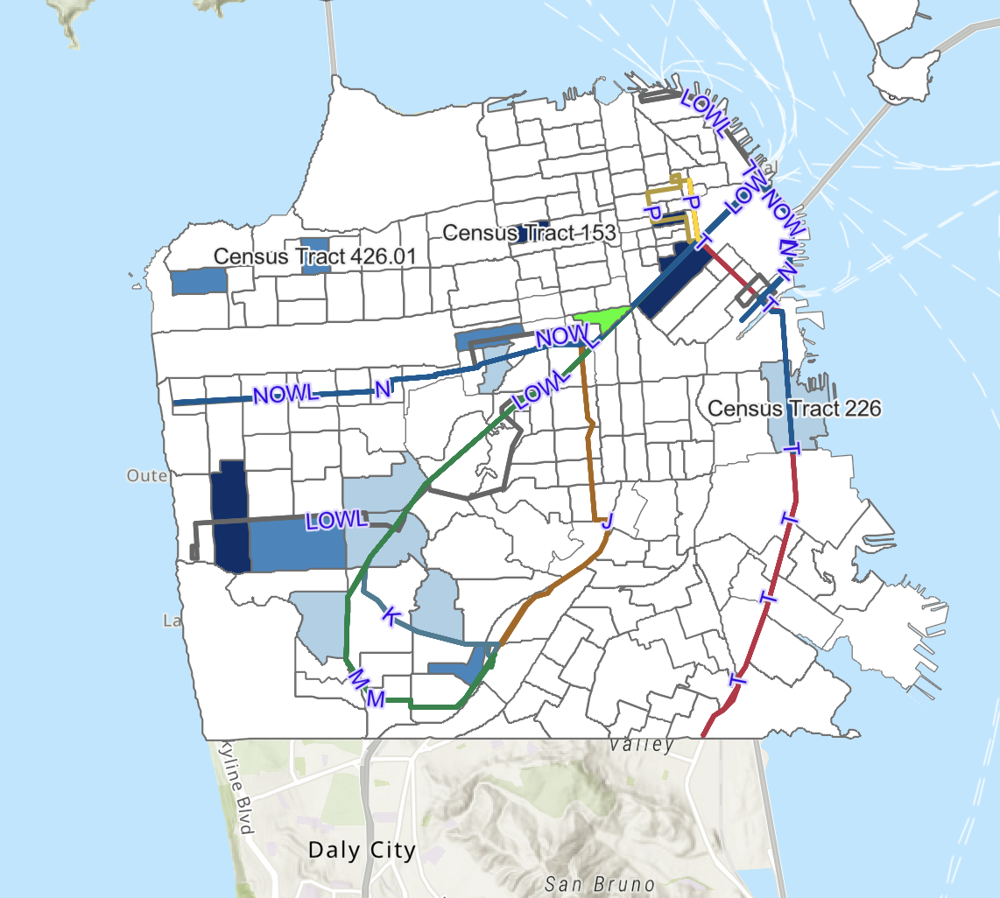
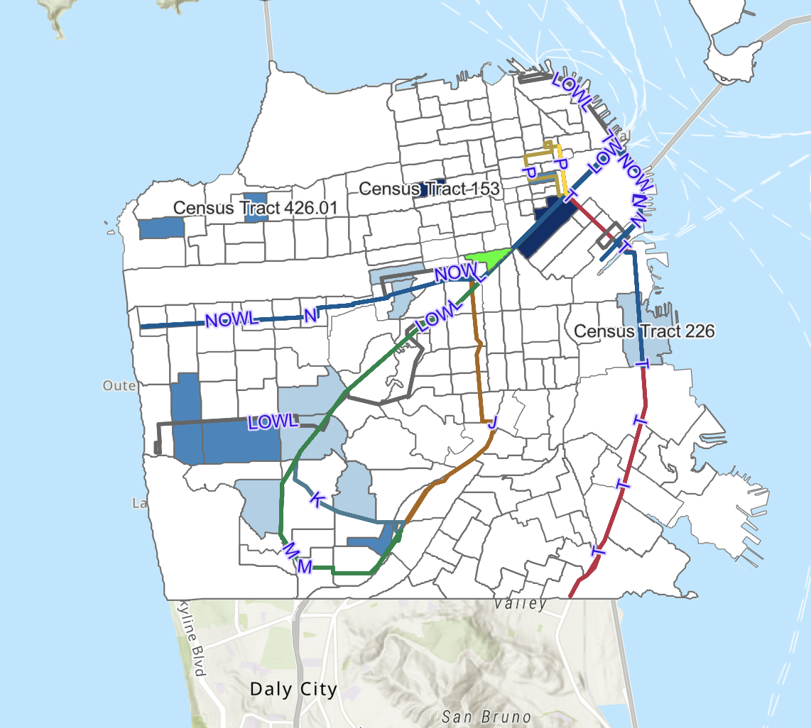
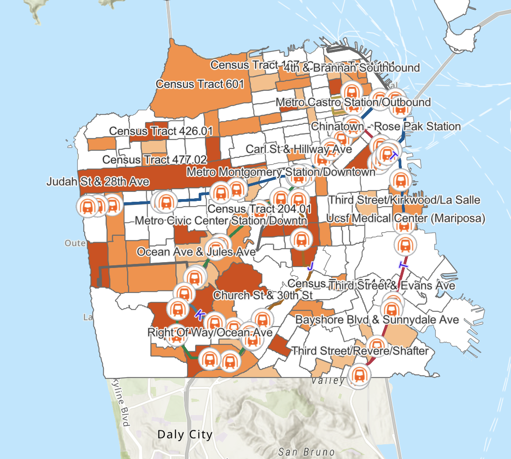
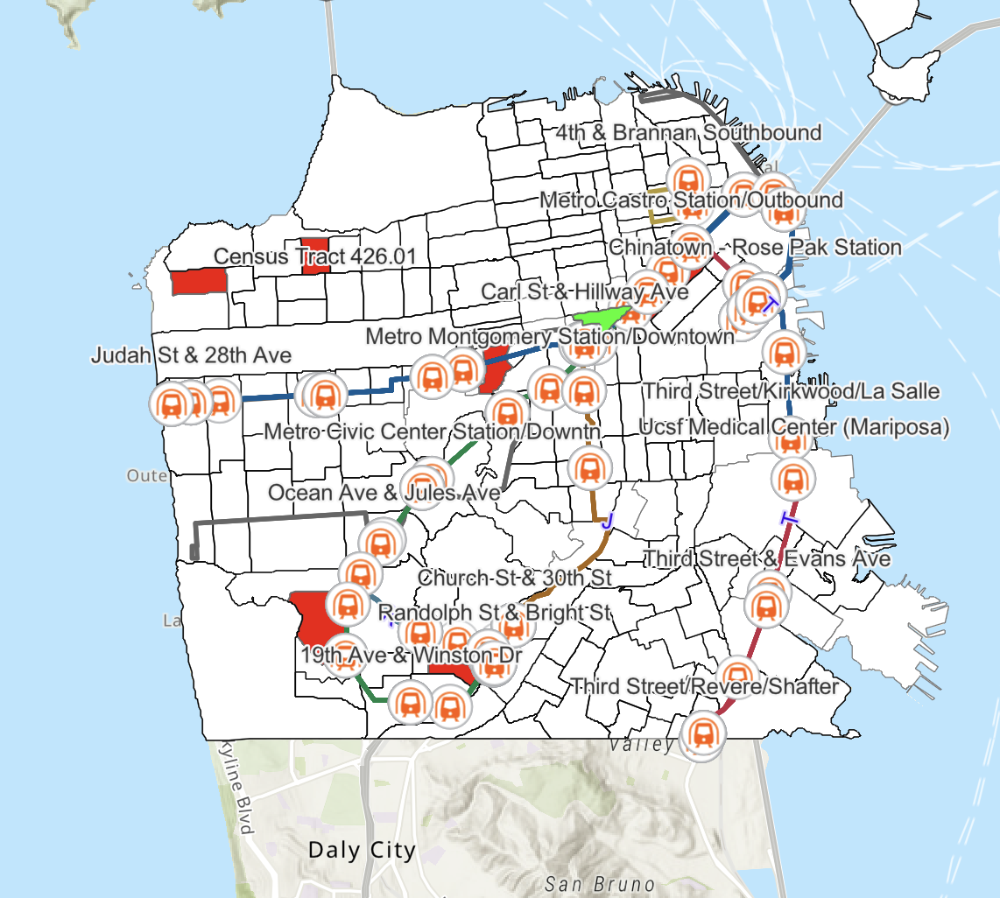

# Assessing the Impact of Muni Metro Transit Station Location on Public Transportation Accessibility: Case Study in San Francisco 

---

## Abstract

The light rail transit system in San Francisco plays a crucial role in urban public transportation, significantly impacting mobility and accessibility. This study enhances the accessibility of the light rail system by integrating transit station location and travel time into accessibility calculations. A comprehensive approach was employed, leveraging data from SFMTA, Open Street Map, and U.S. Census, to analyze the spatial distribution of transit stations and their impact on accessibility.

---

## Introduction

### Background Information

In San Francisco, public transportation, particularly the light rail transit system managed by SFMTA, is vital for daily commuting. The city's network includes multiple lines with 113 stations across 38.9 miles. Despite the critical role of public transport, issues like inequitable access and slow recovery post-pandemic have raised concerns about accessibility and efficiency, prompting the need for a detailed evaluation of transit station accessibility.

**Objectives of the Project**:
- Evaluate the current accessibility of the Muni Metro transit system.
- Develop a robust accessibility index incorporating transit station location and travel time.
- Analyze the spatial distribution of stations and identify barriers to accessibility.
- Compare different accessibility models to identify effective methods for evaluating transit accessibility.

## Methodology

### Data Sources

- **SFMTA GTFS Dataset**: Provides real-time data for map visualization, including vehicle positions and estimated arrival times.
- **U.S. Census Bureau**: Supplies San Francisco shapefiles, population, and commuting data.

### Study Area

San Francisco is the focal area for this study, chosen for its dense population and extensive transit network.

  
  
<em>Figure 1: Study Area with Metro Routes and Stops</em>

### Transit Travel Time Component

  This component models the probability of using a transit route based on travel time. A logistic decay function is used to represent how likely travelers are to wait for transit services.

  

  TDRDij = Transit demand probability based on travel time from origin i to destination j. 
  k = The limit of the logistic decay curve 
  w = Transit travel time (minutes)

  
  
<em>Figure 2:The stop transit demand probability decay function </em>

### Transit Transfer Location Component

A binary parameter indicates whether a trip requires a transfer. Direct routes are preferred due to reduced travel time and increased convenience.
| **Type of Trip**     | **Number of Trips** | **Percentage** | **Transit Probability** |
|----------------------|---------------------|----------------|-------------------------|
| Direct               | 1188                | 79.2%          | 1                       |
| Transfer (one time)  | 312                 | 20.8%          | Vary from 0 to 1 based on transfer location |

  
  
<em>Figure 3: Transfer density based on transit location</em>

## Results

### Transit Accessibility Index

The transit accessibility index incorporates both the transfer location and transfer travel time components. This index provides a unique value for each Origin-Destination (OD) pair, reflecting the likelihood of transit demand.

### Zone-Based Accessibility

The accessibility of each census tract is represented by the average trip probability from that tract to others. 

  
  
<em>Figure 4: Zone-Based Transit Accessibility of all Census Tracts in San Francisco(travel time and transfer location)</em>

  
  
<em>Figure 5: Zone-Based Transit Accessibility of all Census Tracts in San Francisco(travel time)</em>

### Transit Accessibility Example

To explore the impact of transfer locations on a single census tract area, census tract 168.02 is chosen. 

  
  
<em>Figure 6: Transit Network impacts the transit accessibility example(travel time and transfer location)</em>

  
  
<em>Figure 7: Transit Network impacts the transit accessibility example(travel time and transfer location)</em>

---
## Conclusion

Public transportation is crucial for equitable access to essential services. This study's analysis reveals that central and northern parts of San Francisco exhibit higher accessibility, with some southern tracts requiring improvements. The inclusion of location factors provides insights into travelers' behavior and accessibility modes.

  
  
<em>Figure 8: Change in Transit Accessibility Level by Incorporating the Transfer Location Component</em>

  
  
<em>Figure 9: Change in Transit Accessibility Level by Incorporating the Transfer Location Component（example）</em>

---
## Discussion

### Implications of Findings

The study reveals that the strategic placement of transfer stations significantly enhances accessibility within the grid network of San Francisco. The results suggest that considering transfer locations in accessibility models can more accurately reflect actual accessibility levels.

### Limitations of the Study

The study focuses on the Muni Metro system and does not account for multimodal transit behavior. Additionally, it does not consider peak vs. non-peak hour variations, which could influence accessibility.

---

## ArcGIS Story Map  

[Click](https://storymaps.arcgis.com/stories/93fd1dd9e5454d8786e5ee01e15e329e)

## References

1. Ben-Akiva, M., & Lerman, S. R. (1985). *Discrete Choice Analysis: Theory and Application to Travel Demand*. MIT Press.
2. Basso, F., Frez, J., Martínez, L., Pezoa, R., & Varas, M. (2020). Accessibility to opportunities based on public transport GPS-monitored data: The case of Santiago, Chile. *Travel Behaviour and Society, 21*, 140–153. [https://doi.org/10.1016/j.tbs.2020.06.004](https://doi.org/10.1016/j.tbs.2020.06.004)
3. Ceder, A., Chowdhury, S., Taghipouran, N., & Olsen, J. (2013). Modelling public-transport users’ behaviour at connection point. *Transport Policy, 27*, 112–122. [https://doi.org/10.1016/j.tranpol.2013.01.002](https://doi.org/10.1016/j.tranpol.2013.01.002)
4. Cervero, R., & Murakami, J. (2010). Effects of built environments on vehicle miles traveled: Evidence from 370 US urbanized areas. *Environment and Planning A, 42*(2), 400-418.
5. Chia, J., & Lee, J. B. (2020). Extending public transit accessibility models to recognize transfer location. *Journal of Transport Geography, 82*, 102618. [https://doi.org/10.1016/j.jtrangeo.2019.102618](https://doi.org/10.1016/j.jtrangeo.2019.102618)
6. Cheng, Y.-H., & Chen, S.-Y. (2015). Perceived accessibility, mobility, and connectivity of public transportation systems. *Transportation Research Part A: Policy and Practice, 77*, 386–403. [https://doi.org/10.1016/j.tra.2015.05.003](https://doi.org/10.1016/j.tra.2015.05.003)
7. Chowdhury, S., Zhai, K., & Khan, A. (2016). The effects of access and accessibility on public transport users’ attitudes. *Journal of Public Transportation, 19*(1), 97–113. [https://doi.org/10.5038/2375-0901.19.1.7](https://doi.org/10.5038/2375-0901.19.1.7)
8. Curtis, C., & Scheurer, J. (2010). Planning for sustainable accessibility: Developing tools to aid discussion and decision-making. *Progress in Planning, 74*(2), 53–106. [https://doi.org/10.1016/j.progress.2010.05.001](https://doi.org/10.1016/j.progress.2010.05.001)
9. Dehdari Ebrahimi, Z., Momenitabar, M., Nasri, A. A., & Mattson, J. (2022). Using a GIS-based spatial approach to determine the optimal locations of bikeshare stations: The case of Washington D.C. *Transport Policy, 127*, 48–60. [https://doi.org/10.1016/j.tranpol.2022.08.008](https://doi.org/10.1016/j.tranpol.2022.08.008)
10. Fan, Y. (2016). Waiting time perceptions at transit stops and stations: Effects of basic amenities, gender, and security. *Transportation Research Part A: Policy and Practice, 88*, 251–264.
11. Geurs, K. T., & van Wee, B. (2004). Accessibility evaluation of land-use and transport strategies: Review and research directions. *Journal of Transport Geography, 12*(2), 127–140. [https://doi.org/10.1016/j.jtrangeo.2003.10.005](https://doi.org/10.1016/j.jtrangeo.2003.10.005)
12. Gonzalez, E., & Swain, C. (2021). Enhancing public transit networks through optimal transfer station placement. *Transportation Research Part A: Policy and Practice, 145*, 123–137.
13. Guo, Z., & Wilson, N. H. M. (2011). Assessing the cost of transfer inconvenience in public transport systems: A case study of the London Underground. *Transportation Research Part A: Policy and Practice, 45*(2), 91–104.
14. Hensher, D. A., Stopher, P., & Bullock, P. (2003). Service quality—Developing a service quality index in the provision of commercial bus contracts. *Transportation Research Part A: Policy and Practice, 37*(6), 499–517.
15. Heyer, J., Palm, M., & Niemeier, D. (2020). Are we keeping up? Accessibility, equity and air quality in regional planning. *Journal of Transport Geography, 89*, 102891. [https://doi.org/10.1016/j.jtrangeo.2020.102891](https://doi.org/10.1016/j.jtrangeo.2020.102891)
16. Hickman, M., & Wilson, N. H. M. (1995). Passenger preferences and waiting times at multi-stop public transport terminals. *Transportation Research Record, 1503*, 71-78.
17. Higgins, C. D., Xi, Y. L., Widener, M., Palm, M., Vaughan, J., Miller, E. J., & Farber, S. (2022). Calculating place-based transit accessibility: Methods, tools and algorithmic dependence. *Journal of Transport and Land Use, 15*(1), 95–116. Retrieved from [https://www.jstor.org/stable/48719765](https://www.jstor.org/stable/48719765)
18. Malczewski, J. (2004). GIS-based land-use suitability analysis: A critical overview. *Progress in Planning, 62*(1), 3–65. [https://doi.org/10.1016/j.progress.2003.09.002](https://doi.org/10.1016/j.progress.2003.09.002)
19. Mamun, S. A., Lownes, N. E., Osleeb, J. P., & Bertolaccini, K. (2013). A method to define public transit opportunity space. *Journal of Transport Geography, 28*, 144–154. [https://doi.org/10.1016/j.jtrangeo.2012.12.007](https://doi.org/10.1016/j.jtrangeo.2012.12.007)
20. Pitale, A. M., Parida, M., & Sadhukhan, S. (2022). GIS-MCDM–based approach to determine the potential facility locations for park-and-ride facilities along transit corridors. *Journal of Urban Planning and Development, 148*(1), 05021065. [https://doi.org/10.1061/(ASCE)UP.1943-5444.0000799](https://doi.org/10.1061/(ASCE)UP.1943-5444.0000799)
